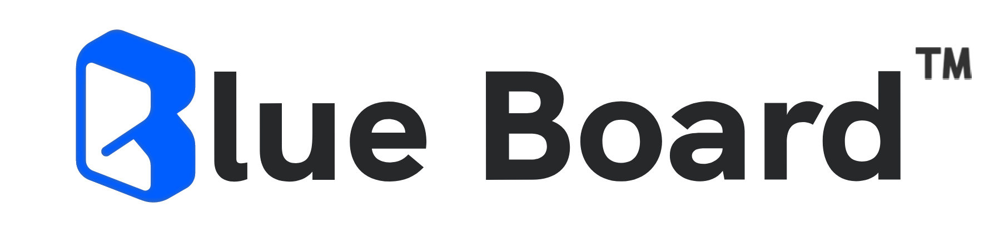

# Blue Board

## Introduction

Blue Board is a comprehensive project management platform designed to enhance team collaboration and project tracking. With an emphasis on user-friendly design and functionality, Blue Board integrates various web technologies to provide a seamless experience for managing tasks, schedules, and communications.

## Key Features

- **Interactive Scrum Board**: Leverage our Scrum board for visualizing workflows, made interactive through the use of HTML elements, CSS for styling, and JavaScript for dynamic user interactions.

- **Detailed Task View**: Gain insights into every task with detailed views, utilizing `<i>` for icons, `<a>` for links, and custom CSS classes to bring clarity and depth to task information.

- **Integrated Schedule**: Stay on top of deadlines with our calendar feature, implemented with `
` tags for structure, and enhanced with Bootstrap's grid system for responsive layouts.

- **Team Discussions**: Foster team communication with dedicated discussion areas, facilitated by `<textarea>` for input and `<button>` elements for submission, ensuring a collaborative environment.

- **Contact Form**: Reach out for support or inquiries through our contact form, built with `<form>`, `<input>`, and `<button>` tags, and backed by PHP for server-side integration.

## Technologies Used

- **HTML5**: For structuring content with semantic elements like `<header>`, `<nav>`, `<section>`, and `<footer>`.
- **CSS3**: For styling and responsive design, leveraging external libraries like Bootstrap and custom stylesheets.
- **JavaScript**: To enhance interactivity, particularly in the Scrum board and contact form validation.
- **Bootstrap**: Utilized for responsive design components, including the navigation bar and form elements.
- **Swiper**: For creating responsive, touch-enabled carousels in sections like Solutions and Clients.
- **AOS**: Animate On Scroll Library for adding animations to various elements as they come into view.
- **Google Fonts**: For custom typography, enhancing the user interface with a variety of font styles.

## Getting Started

To get started with Blue Board:

1. **Visit the Website**: Navigate to the Blue Board site and explore the various features.
2. **Sign In**: Use the Login page to access your account, or contact support to create a new one.
3. **Explore Features**: Dive into project management with the interactive Scrum board, detailed task views, and more.

For more information or to request a demo, reach out through our Contact Us section.

## Team Members

- Charmy Darji - darji.c@northeastern.edu
- Somil Shah - shah.som@northeastern.edu
- Akshaya GAvhane - gavhane.a@northeastern.edu
- Manish Kottamgari - kottamgari.m@northeastern.edu
- Navdish Batra - batra.ku@northeastern.edu
